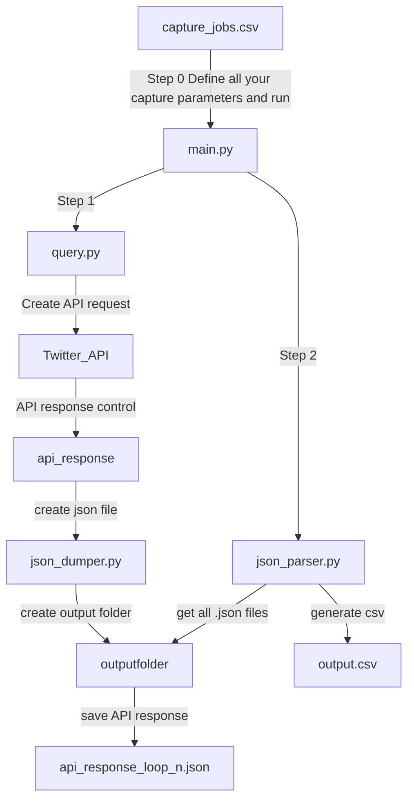

# Twitter for Academic Research

## Introduction
This is a fully functional example on how "Search Tweets" Endpoint (Twitter API V2) works. To make it work, you'll need:
- Access to the full [Twitter Archive for Academic Research](https://developer.twitter.com/en/solutions/academic-research)
- A Bearer Token (once your access is aproved, you'll need to create a new app and generate the Bearer Token).

## Versions
I created two versions for the same script:
- **DataBase version**: Will dump all data from the Twitter API to a MySQL/MariaDB database. (**discontinued**)
- **Local Version**: Will create a .json file for each loop (450 tweets per loop). When all data is downloaded, the script generates a .csv pharsing all .json files downloaded.

## Before Using
Before using, please carefully read the documentation available on the twitter API V2. This is not intended to be a perfect example, but it can help you better understand how the V2 Twitter API works, and how to perform queries taking advantage of the access level for researchers. There you will find answers to many of the questions you may have.

[Search Tweets READ THE DOCS](https://developer.twitter.com/en/docs/twitter-api/tweets/search/introduction)

## Possible Dependencies
```bash
os
json
requests
Pandas
Openyxl # For xlsx datasets
```
## Setup
You'll need:
- Python3 installed
- Commandline interface (Windows/linux/MacOs terminals)
- Recommend PyCharm IDE or similar, with/or virtual enviroments.

**Define credentials (credentials.py)**
Copy/Paste your Twitter API Bearer Token in credentials.py
If you use DB version, you'll need to define DB username, password and table names in the same file.

## workflow
### 1. Define Search jobs in capture_jobs.csv
You can define one or **multiple searchs** (one row per search). The script will iterate over the file to search tweets within parameters.
|start     |start_time|end       |end_time|query             |date_format|time_format|capture_name    |
|----------|----------|----------|--------|------------------|-----------|-----------|----------------|
|dd/mm/yyyy|hh:mm:ss  |dd/mm/yyyy|hh:mm:ss|your query|DD-MM-YYY  |HH:MM:SS   |capture save name|

**Example 1**
|start     |start_time|end       |end_time|query             |date_format|time_format|capture_name    |
|----------|----------|----------|--------|------------------|-----------|-----------|----------------|
|20/01/2021|00:00:00  |27/01/2022|23:59:00|(#ucrania) lang:es|DD-MM-YYY  |HH:MM:SS   |ucrania_hashtags|

will search all tweets between 20 january 2021 at 00:00:00, to january 27 2022 at 23:59:59 with the hashtag #ucrania in spanish language

You can create **multiple rows**. Each row is a new capture, and it's useful to create a work queue.

**OUTPUT FOLDER** 
Define the output folder in "capture_name" field

### 2. Launch the script 
In terminal:
```
python3 main.py
```

## Script Workflow ##



## API RATE LIMITS
Twitter API V2, and more precisely, Twitter Full-archive search for Academic Research, have a rate limit of 300 request in a 15 min window. Please, don't change sleep times between queries. 

## Handling errors

During execution, the API query, or when parsing the data, various errors can occur. The script contains the following error handling:
- Request too many requests to the API
- API Timeout
- Empty API responses
- ### Known Errors:
- On big extractions: Native Python3 Recursion limit to 1000 loops. Then recursion limit error. This may occur near 500k tweets retrieved.

### Updates log:
- 06/11/2021: add "In_reply_to_username" in output .csv file for local version.
