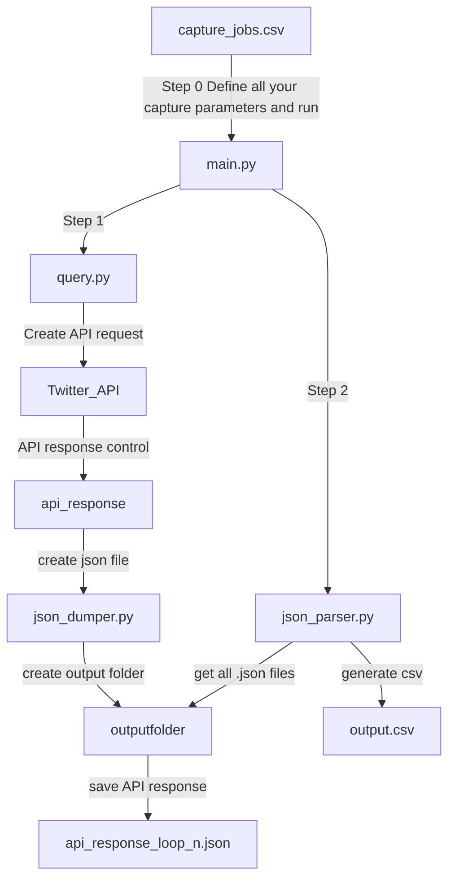

# TWITTER ACADEMIC API IS CLOSED. THIS REPO IS OUT OF DATE

# Twitter for Academic Research


## Introduction
This is a functional example of how "Search Tweets (all)" Twitter's API Endpoint (API V2) works. To make it work, you'll need:
- Request Access to the full [Twitter Archive for Academic Research](https://developer.twitter.com/en/solutions/academic-research)
- A Bearer Token (once your request access is aproved, you'll need to create a new "project" and generate the Bearer Token).

## Before Using
Before using, please carefully read the documentation available on the twitter API V2. This code is not intended to be a perfect example, but it can help you better understand how the V2 Twitter API works, and how to perform queries taking advantage of the access level for researchers. There you will find answers to many of the questions you may have.

[Search Tweets READ THE DOCS](https://developer.twitter.com/en/docs/twitter-api/tweets/search/introduction)
[¿HOW TO BUILD A QUERY?](https://developer.twitter.com/en/docs/twitter-api/tweets/search/integrate/build-a-query)

## Possible Dependencies
```bash
os
json
requests
Pandas
Openyxl # For xlsx datasets
tqdm (for progress bar)

Note: To install this packages use "pip install package_name" in your termninal.
```
## Setup
You'll need:
- Python3 installed
- Commandline interface (Windows/linux/MacOs terminals)
- Recommend PyCharm IDE or similar, with/or virtual enviroments.

**Define credentials (credentials.py)**
Copy/Paste your Twitter API Bearer Token in credentials.py

## workflow
### 1. Define your search jobs in capture_jobs.csv

| start      | start_time | end        | end_time | query                  | capture_name  |
|------------|------------|------------|----------|------------------------|---------------|
| dd/mm/yyyy | HH:MM:SS   | dd/mm/yyyy | HH:MM:SS | complete Query String  | output folder |

You can define one or **multiple searchs** (one row per search). The script will iterate over the csv file to search tweets within parameters.


**Example (Job queue)**
| start      | start_time | end        | end_time | query                  	       | capture_name |
|------------|------------|------------|----------|------------------------------------|--------------|
| 01/01/2010 | 00:00:00   | 16/03/2023 | 23:59:59 | from:POTUS 		               | DM_POTUS     |
| 01/01/2022 | 00:00:00   | 10/02/2023 | 23:59:59 | (#Ukraine OR #Ucrania) -is:retweet | ukraine      |

- Fisrt job (first Row) will search all tweets made by @potus Twitter account between january 1st 2010 at 00:00:00, to march 16 20223 at 23:59:59, and save all data with .csv output in /DM_POTUS/ folder.
- Second job (second row) will search all tweets containing #Ukraine OR #Ucrania hashtags (one of them or both) and not collect retweets. And Will save all data in /ukraine/ folder

You can create **multiple rows**. Each row is a new capture, and it's useful to create a work queue.

**capture_name** 
Define the output folder in "capture_name" field. Each capture have it's own output folder.

### 2. Launch the script 
In terminal:
```
python3 main.py
```

## Script Workflow ##



## API RATE LIMITS
Twitter API V2, and more precisely, Twitter Full-archive search for Academic Research, have a rate limit of 300 request in a 15 min window. Please, don't change sleep times between queries. 

## Handling errors

During execution, the API query, or when parsing the data, various errors can occur. The script contains the following error handling:
- Request too many requests to the API
- API Timeout
- Empty API responses
- ### Known Errors:
- On big extractions: Native Python3 Recursion limit to 1000 loops. Then recursion limit error. This may occur near 500k tweets retrieved.
